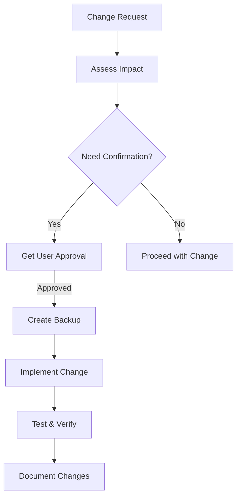
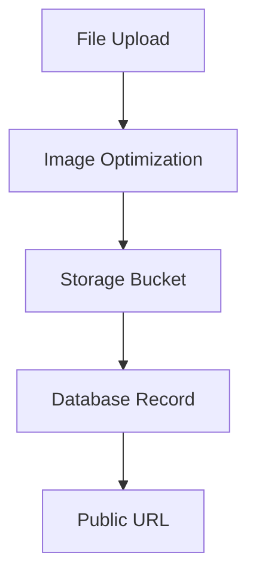

# System Patterns

## Architecture Overview

### High-Level Architecture


## Core Patterns

### Offline-First Pattern
- IndexedDB for client-side storage
- Optimistic UI updates
- Background sync queue
- Conflict resolution strategies
- Progressive enhancement

### Data Synchronization
- Queue-based sync system
- Version control for records
- Timestamp-based conflict resolution
- Batch processing for efficiency
- Delta updates when possible

### Form Management
- Dynamic form rendering
- JSON schema validation
- Form state management
- Field dependency handling
- Custom validation rules

### Geospatial Features
- GeoJSON for feature storage
- Spatial indexing
- Vector tile support
- Floor plan registration
- Coordinate system management

## Component Architecture

### Frontend Components


### Backend Services


## Data Patterns

### Feature-Inspection Relationship


### Form Data Structure
```json
{
  "formId": "string",
  "version": "number",
  "schema": "object",
  "uiSchema": "object",
  "validationRules": "array",
  "attachments": [{
    "type": "photo",
    "path": "string",
    "metadata": {
      "location": "object",
      "timestamp": "string",
      "optimized": "boolean"
    }
  }]
}
```

## Security Patterns
- JWT-based authentication
- Role-based access control
- Data encryption at rest
- Secure file handling
- API rate limiting

## Performance Patterns
- Lazy loading of components
- Progressive loading of map data
- Efficient form rendering
- Optimized database queries
- Caching strategies

## Error Handling
- Graceful degradation
- Retry mechanisms
- Error boundaries
- Logging and monitoring
- User feedback systems

## Code Preservation Patterns


### Key Principles
- Never overwrite components without explicit confirmation
- Preserve unrelated functionality
- Document component changes thoroughly
- Maintain component backups for critical changes
- Isolate feature-specific modifications
- Get approval for major modifications
- Save current work before significant changes

### Implementation Guidelines
- Create component backups before major rewrites
- Use version control effectively
- Document changes in commit messages
- Test preserved functionality
- Maintain component independence
- Follow the principle of least surprise
- Keep changes focused and minimal

### Storage Patterns


- Client-side optimization
- Bucket-based storage
- File type validation
- Automatic cleanup
- URL-based access

### File Handling
- Image optimization pipeline
- Secure file uploads
- Polymorphic relationships
- Metadata tracking
- Location tagging

## Performance Patterns
- Lazy loading of components
- Progressive loading of map data
- Efficient form rendering
- Optimized database queries
- Caching strategies

## Error Handling
- Graceful degradation
- Retry mechanisms
- Error boundaries
- Logging and monitoring
- User feedback systems 